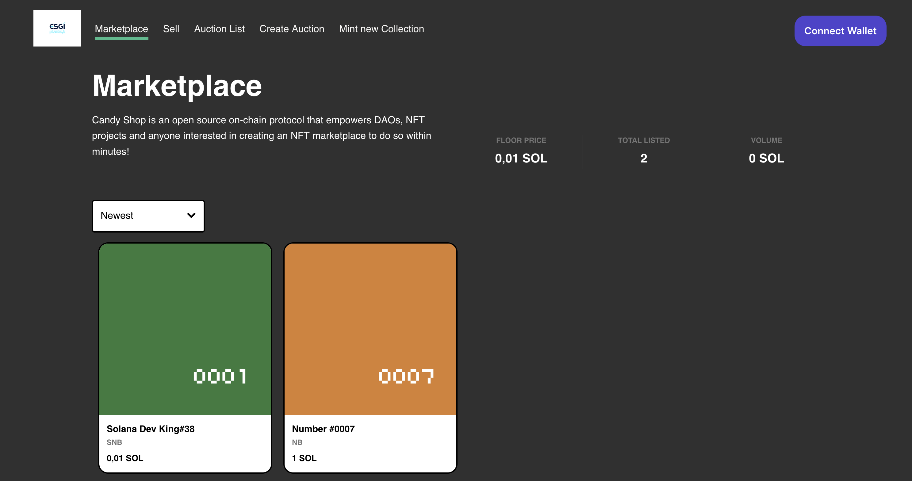

# Solana Marketplace with Candy-Shop and Candymachine

 <!-- You can add your project logo here -->

This repository contains the source code for a decentralized marketplace built on the Solana blockchain using TypeScript. The marketplace utilizes the Candy-Shop and Candtmachine libraries to enable the creation, management, and trading of digital assets in a decentralized and secure manner.

## Table of Contents

- [Introduction](#introduction)
- [Features](#features)
- [Installation](#installation)
- [Usage](#usage)
- [Contributing](#contributing)
- [License](#license)

## Introduction

The Solana Marketplace with Candy-Shop and Candtmachine is a decentralized application (DApp) that empowers users to buy, sell, and trade digital assets directly on the Solana blockchain. This project leverages the power of smart contracts to create a trustless environment where users can transact with each other without intermediaries.

## Features

- **Candy-Shop Integration:** Candy-Shop is a powerful library for creating and managing digital collectibles. This project integrates Candy-Shop to enable users to mint, display, and trade NFTs seamlessly.

- **Candymachine Integration:** Candymachine complements Candy-Shop by providing an auction mechanism for NFTs. Users can auction their NFTs using Candtmachine, allowing others to bid on and acquire these unique digital assets.


- **Solana Blockchain:** Built on the Solana blockchain, the marketplace benefits from Solana's high throughput and low transaction fees, ensuring a smooth and cost-effective user experience.

## Installation

Follow these steps to set up the project locally:

1. Clone the repository:
   ```bash
   git clone https://github.com/your-username/solana-marketplace.git
   ```

2. Navigate to the project directory:
   ```bash
   cd solana-marketplace
   ```

3. Install project dependencies:
   ```bash
   npm install
   ```

## Usage

1. Compile TypeScript code:
   ```bash
   npm run build
   ```

2. Run the application:
   ```bash
   npm start
   ```

3. Access the application through your web browser at `http://localhost:3000`.

## Contributing

Contributions are welcome! If you want to contribute to this project, follow these steps:

1. Fork the repository.

2. Create a new branch:
   ```bash
   git checkout -b feature/your-feature-name
   ```

3. Make your changes and commit them:
   ```bash
   git commit -m "Add your commit message here"
   ```

4. Push your changes to your forked repository:
   ```bash
   git push origin feature/your-feature-name
   ```

5. Create a pull request detailing your changes.

## License

This project is licensed under the [MIT License](LICENSE).

---

Feel free to customize this README according to your project's specific details and requirements. Don't forget to update the placeholders like `your-username` and provide appropriate links, images, and descriptions as needed. Good luck with your Solana Marketplace project!
